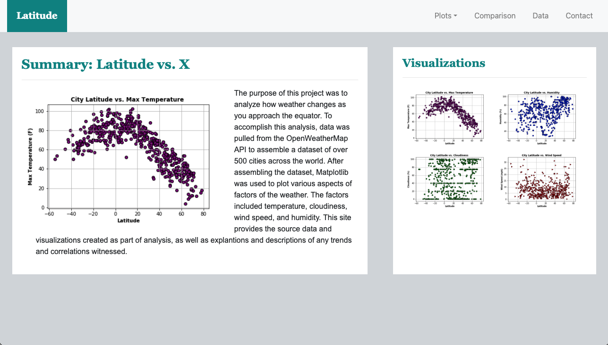
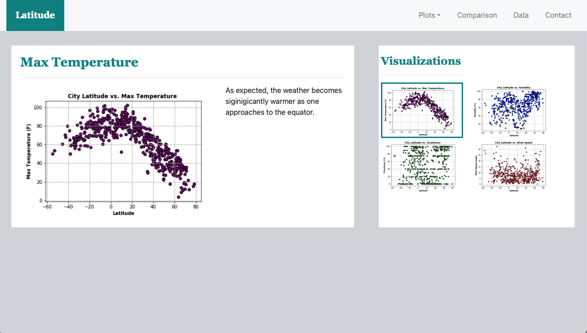
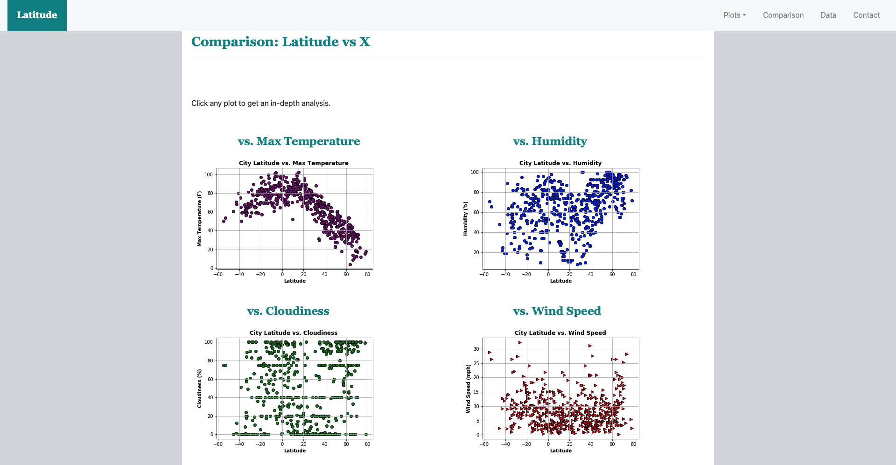
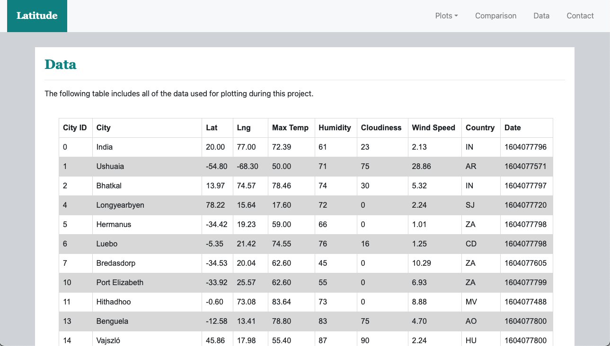
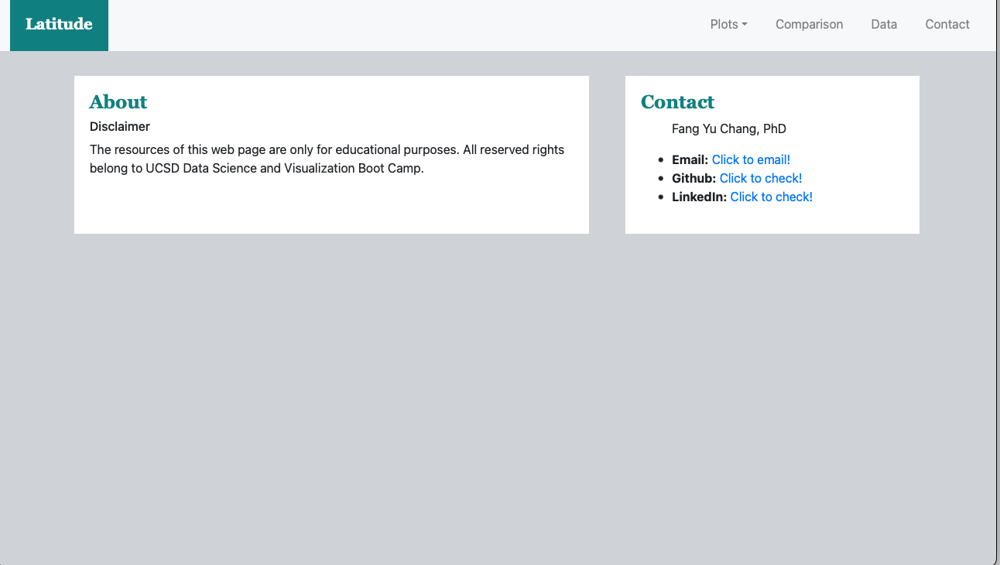

## Web-Design-Challenge
### Latitude - Latitude Analysis Dashboard
For this project, a visualization dashboard website using visualizations was created in the [weather project](https://github.com/changrita1114/python-api-challenge). Specifically, the weather data was plotted.
In building this dashboard,the individual pages for each plot and a means by which users can navigate between them were created. These pages contain the visualizations and their corresponding explanations. There is a landing page as well, a page where users can see a comparison of all of the plots, and another page where users can view the data used to build them.
#### Website Design
The website consists of 8 pages total, including:
* A "Landing" page containing:

    * An explanation of the project.
    * Links to each visualization page. There is a sidebar containing preview images of each plot, and clicking an image will take the user to that visualization.

* Four "Visualization" pages, each with:

    * A descriptive title and heading tag.
    * The plot/visualization itself for the selected comparison.
    * A paragraph describing the plot and its significance.

* A "Comparisons" page that:

    * Contains all of the visualizations on the same page so users can easily visually compare them.
    * A Bootstrap grid was used for the visualizations.

* A "Data" page that:

    * Displays a responsive table containing the data used in the visualizations.

      * The table is a Bootstrap table component.

      * The data came from exporting the .csv file as HTML, and a Pandas function called to_html was used to generate a HTML table.

* A "Contact" page that:
    * Includes the disclaimer and author contact information.

The website, at the top of every page, has a navigation menu that:

*    Has the name of the site on the left of the nav which allows users to return to the landing page from any page.
*    Contains a dropdown menu on the right of the navbar named "Plots" that provides a link to each individual visualization page.
*    Provides two more text links on the right: "Comparisons," which links to the comparisons page, and "Data," which links to the data page.
*    Is responsive (using media queries). The nav must have similar behavior as the screenshots "Navigation Menu" section (notice the background color change).

#### Dashboard Link:
https://changrita1114.github.io/Web-Design-Challenge/
### Disclaimer
The resources of this master branch are only for educational purposes. All reserved rights belong to UCSD Data Science and Visualization Boot Camp.
